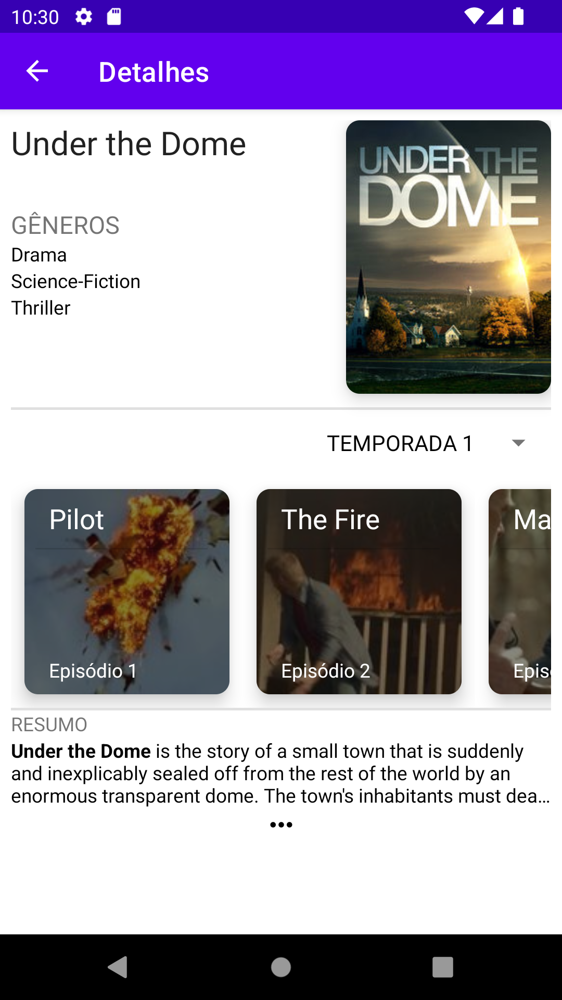

# MOVIE DATABASE
Creating a Movie Database application using Kotlin and some other features. It contains a list with more than of 65000 shows, each one with it episodes and seasons.

Also contains a search bar, for a more deeper navigation into the shows.

# ABOUT PROJECT
The application was made as part of an internship program.

This project uses:
* Clean Arch
* MVVM
* Retrofit
* Jetpack Navigation
* Binding
* ViewModel
* Flow

# SCREENSHOTS

# API & REFERENCES
The API used for the project is the [TVMaze](https://www.tvmaze.com/api). The following params are used for requisitions on API.

*base url: [api.tvmaze.com](https://api.tvmaze.com)*
>  /search/shows?q=:query  
Is used for search method and request.

>  /shows?page=:num  
Get the first 249 shows on page 0, requested in home page for default.

>  /shows/:id  
Get all show content by id.

>  /shows/:id/seasons  
Get the shows seasons with their numbers and id.

>  /seasons/:id/episodes  
Uses the show season id to get episodes on show details page